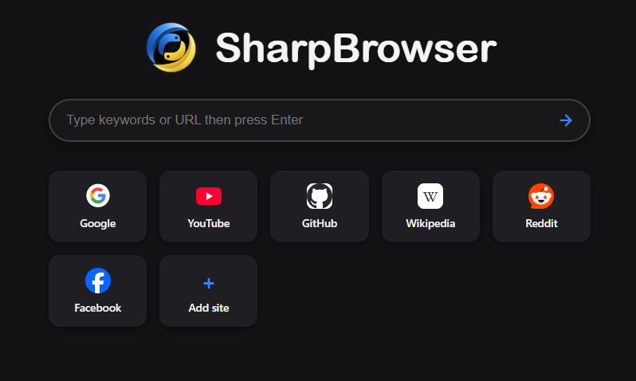

<div align="center">

# SharpBrowser

**A lightweight desktop web browser built with Python 3.14, PyQt6, and Qt WebEngine.**

Clean by design. Built for experimentation and customization. Open-source and safe.

</div>

---

<p align="center">
  
</p>

<p align="center"><sub>SharpBrowser home page — dark theme with search, shortcuts, and site cards.</sub></p>

---

## ✨ About

SharpBrowser is a custom desktop browser project written in Python. It uses **PyQt6** for the user interface and **Qt WebEngine** for web rendering, giving the project a native desktop shell around a Chromium-based browsing engine.

The goal is simple: build a modern-looking browser from Python while keeping the interface clean, customizable, and easy to extend.

## 🚀 Features (Based on Build 1902.2)

- 🌐 **Web browsing** powered by Qt WebEngine
- 🗂️ **Tabbed browsing** with movable and closable tabs
- 🔎 **Search & navigation** from the browser interface
- 🏠 **Custom new-tab page** with site shortcuts
- ➕ **Add, rename, and remove shortcuts**
- 🌓 **Light and dark themes**
- 📥 **Download manager** with progress, speed, ETA, and download history
- 🕘 **Browsing history** with management controls
- 🔖 **Bookmarks and saved browser data**
- ⚙️ **Native settings page** for personalization, search engine, downloads, and system options
- 🪟 **Multiple windows and pop-up handling**
- 🎮 **Hardware acceleration options** and Chromium rendering flags
- 💾 **Persistent browser data** stored locally between launches

## 🛠️ Tech Stack

| Technology | Purpose |
|---|---|
| **Python 3.14** | Application logic |
| **PyQt6** | Desktop GUI |
| **Qt WebEngine** | Web page rendering and browser engine |
| **HTML / CSS / JavaScript** | Custom SharpBrowser home page |
| **JSON** | Local history, bookmarks, downloads, and session data |

## 📦 Requirements

- Windows 10/11
- Python 3.14
- PyQt6
- PyQt6-WebEngine

### Install dependencies manually

SharpBrowser needs **both PyQt6 and the separate PyQt6-WebEngine package**. The WebEngine package provides the Qt WebEngine modules used by the browser.

Install them one at a time:

```powershell
python -m pip install PyQt6
python -m pip install PyQt6-WebEngine
```

Or install everything in one command:

```powershell
python -m pip install PyQt6 PyQt6-WebEngine
```

If you see an error such as `ModuleNotFoundError: No module named 'PyQt6.QtWebEngineWidgets'`, make sure **PyQt6-WebEngine** is installed.

## ▶️ Run SharpBrowser

Clone the repository, open a terminal in the project folder, then run:

```powershell
python browser.py
```

## 🗂️ Project Layout

```text
SharpBrowser/
├── browser.py
├── icon.ico
├── icon.png
├── assets/
│   └── sharpbrowser-home.png
└── README.md
```

The browser also creates its own local application data directory in the user's home folder for browser state such as history, downloads, bookmarks, sessions, and WebEngine profile data.

## 🧩 Custom Icon

SharpBrowser can use a local icon placed beside `browser.py`:

```text
icon.ico
icon.png
```

The application checks for the icon files at runtime, so they can be used for the application window and the custom browser interface.

## 📦 Build a Standalone Windows EXE

To package SharpBrowser so the target PC does not need Python or the Python packages installed, install PyInstaller:

```powershell
python -m pip install -U pyinstaller
```

Then build:

```powershell
pyinstaller --onefile --windowed --icon=icon.ico --add-data "icon.ico;." --add-data "icon.png;." --name SharpBrowser browser.py
```

The finished executable will be placed in:

```text
dist/SharpBrowser.exe
```

> **Note:** Qt WebEngine includes a large browser runtime, so a packaged SharpBrowser executable can be significantly larger than a typical Python application. That's expected.

## 🎯 Project Goals

SharpBrowser is primarily a learning and experimentation project focused on:

- desktop application development with Python
- browser UI design
- Qt / WebEngine integration
- local browser storage and state management
- packaging Python applications for Windows

## 🔮 Possible Future Ideas

Some natural areas for future development include custom themes, extension support, improved privacy controls, more search engines, a downloads page redesign, browser startup options, and further performance tuning.

## 📄 License

SharpBrowser
Copyright (©) 2026 @RevinHere

Licensed under the Apache License, Version 2.0.
You may obtain a copy of the License at:
https://www.apache.org/licenses/LICENSE-2.0

---

<div align="center">

**SharpBrowser** · Built with Python 🐍 · Powered by Qt WebEngine ⚡

</div>
